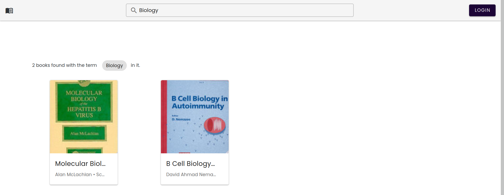
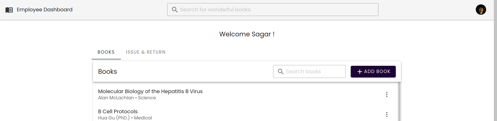
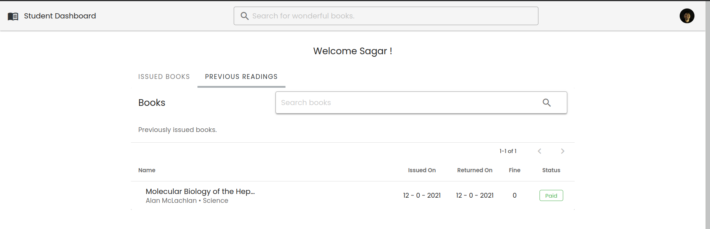

# Library Management System

A Library web app made using MEVN stack (Mongodb, Express, Vuejs, Nodejs) and Vuetify Material UI framework.

## Introduction

You can add Students and Employees into the system.
In this system you need be aware about some terminologies such as

1. Issue:- To borrow a book from library the student goes to employee. An employee can issue the book to that student.
2. Return:- To return the borrowed book the student again goes to the employee and returns it. The employee accordingly accepts that book.
3. Reissue:- A student can reissue a book that they have currently lended to extend the due date by 7 day. They can only reissue twice.

## Features

### 1. Book Search

You can search from wide varities of books available in the system.



### 2. Employee Dashboard

An employee can manage books i.e. add, delete or edit and handle issue/return work.


### 3. Student Dashboard

A student can view the issued book details in their account. They can also re-issue the currently issued book.


## Directory

Both frontend and backend are seperated. Frontend is made using Vue and Vuetify.
Backend server is made using Express, Mongo and Nodejs.

## Installation

Before getting started it's important to have some static data in our MongoDB. I've provided some data which includes few books and users. Just run following commands .

```shell
mongorestore -d library ./Backend/data/library
```

Both frontend and backend have package.json file which means both require it's individual modules.

```shell
cd Frontend && npm i
cd Backend && npm i
```

## Starting the app.

You'll need to turn on both frontend and backend on seperate terminal.

1. To run the frontend

```shell
npm run serve
```

2. To run the backend

```shell
node server.js
```
